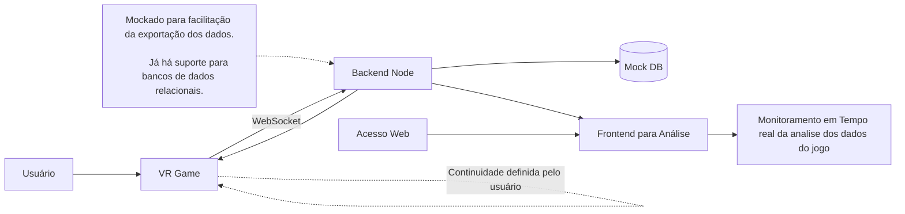

## Descrição Declarativa

A versão em RV do jogo de tabuleiro “Aventura na Trilha da Lagoa da Mata”, desenvolvido pela equipe do Laboratório de Limnologia da UFRJ (doravante chamado de TLM) foi desenvolvida com a intenção de aprimorar a imersão do jogador, integrando características presentes na trilha para fazê-lo ter uma experiência mais próxima da realidade.

 

## Arquitetura

A arquitetura do Trilha foi desenvolvida a fim de permitir multíplas conexões ao backend, e este trata os dados tanto para exibição do Frontend para análise dos dados quanto para prosseguir com o jogo.
Apesar de atualmente o backend estar mockado, já possui suporte integrado e facilitado para inserção de um bd.
Esta estrutura prevê duas arquiteturas diferentes em torno do backend centralizado (possuindo suporte para descentralização). Sendo a arquitetura VR -> Backend a arquitetura em camadas, onde o jogo ocorre na primeira camada e na segunda ocorre a conexão do sistema a parte e na terceira são onde estarão mantidos dos dados contidos inicialmente no backend e a conexão backend -> frontend compondo a arquitetura   cliente - servidor.

## Estrutura do projeto
O projeto está estruturado em pastas de acordo com o seu destino seu tipo de objeto. Árvores, Rochas, Scripts,  Packages, Cenas e etc.
Cada pasta têm subpastas com as informações de onde vieram os objetos (criador e etc), excetos em casos de Fotogrametria, onde somos os criadores e estão em uma pasta de mesmo nome.

## Publicações

CRUZ, Lucas Rangel da; SANTOS, Nicole Cristina Vieira dos; SOUZA, Luiz André de; OLIVEIRA, Andressa dos Santos; SILVA, Marcelo Arêas Rodrigues da; SANTOS, Joel André Ferreira dos. Trails of Performance: A Study of Real Time Optimization Techniques in Heterogeneous Natural Environments for VR. In: SIMPÓSIO BRASILEIRO DE JOGOS E ENTRETENIMENTO DIGITAL (SBGAMES), 24. , 2025, Salvador/BA. Anais [...]. Porto Alegre: Sociedade Brasileira de Computação, 2025 . p. 714-725. DOI: https://doi.org/10.5753/sbgames.2025.10340.

## Trabalhos Futuros

No viés de trabalhos futuros ficam:
* Incrementos do módulo de multiplayer.
* Remoção do módulo de jogo de tabuleiro.
* Mudanças no carregamento do jogo, a fim de carregar as cenas com uma tela de load.
* Mudanças no cenário de Menu e Endgame.
* Adição de mais objetos explorativos e um mapa de busca com os objetos a serem encontrados.
