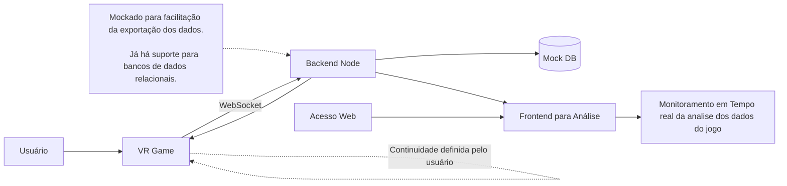

<table>

<tr>
<th>Tela:</th>
<th>ID:</th>
<th>Descrição</th>
</tr>
<tr>
<td>Menu</td>
<td>1</td>
<td>Tela onde acontece a Entrada do jogador, ele coloca seu nome e entra na sala designada (atualmente fixada em 1)</td>
</tr>
<tr>
<td>Jogo (V2)</td>
<td>2</td>
<td>Tela principal do jogo em realidade virtual, onde o jogador percorre a trilha
em formato de tabuleiro virtual. O avanço ocorre a partir do lançamento do dado,
permitindo a movimentação do peão ao longo dos ladrilhos. Durante o percurso,
o jogador interage com cartas de desafio, perguntas educativas, objetos
explorativos e elementos informativos do ambiente. As respostas, ações e
pontuações são registradas e enviadas ao servidor em tempo real via WebSocket,
permitindo a análise posterior dos dados do jogo.</td>
</tr>
<tr>
<td>EndGame</td>
<td>3</td>
<td>Tela onde acontece a Saida ou Reentrada do jogador no game, ele seleciona o botão e entra na sala em que estava (atualmente fixada em 1) ou sai do jogo</td>
</tr>
</table>

## Descrição Declarativa

A linguagem NCL360 define uma notação simplificada para a criação de uma cena 360 a ser executada no motor de apresentação Guaraná. A notação é baseada na linguagem NCL, permitindo a criação da cena num formato similar aquele usado para a criação de aplicações multimídia interativas.

Assim como em NCL, todo o comportamento da cena é definida indicando as mídias que fazem parte da cena e os *links* que definem quando cada mídia é executada. Diferente da linguagem NCL tradicional, NCL360 posiciona as mídas ao redor do usuário, formando um cenário em 360º.

 

## Arquitetura

A arquitetura do Trilha foi desenvolvida a fim de permitir multíplas conexões ao backend, e este trata os dados tanto para exibição do Frontend para análise dos dados quanto para prosseguir com o jogo.
Apesar de atualmente o backend estar mockado, já possui suporte integrado e facilitado para inserção de um bd.
Esta estrutura prevê duas arquiteturas diferentes em torno do backend centralizado (possuindo suporte para descentralização). Sendo a arquitetura VR -> Backend a arquitetura em camadas, onde o jogo ocorre na primeira camada e na segunda ocorre a conexão do sistema a parte e na terceira são onde estarão mantidos dos dados contidos inicialmente no backend e a conexão backend -> frontend compondo a arquitetura   cliente - servidor.

## Estrutura do projeto
O projeto está estruturado em pastas de acordo com o seu destino seu tipo de objeto. Árvores, Rochas, Scripts,  Packages, Cenas e etc.
Cada pasta têm subpastas com as informações de onde vieram os objetos (criador e etc), excetos em casos de Fotogrametria, onde somos os criadores e estão em uma pasta de mesmo nome.

## Publicações

CRUZ, Lucas Rangel da; SANTOS, Nicole Cristina Vieira dos; SOUZA, Luiz André de; OLIVEIRA, Andressa dos Santos; SILVA, Marcelo Arêas Rodrigues da; SANTOS, Joel André Ferreira dos. Trails of Performance: A Study of Real Time Optimization Techniques in Heterogeneous Natural Environments for VR. In: SIMPÓSIO BRASILEIRO DE JOGOS E ENTRETENIMENTO DIGITAL (SBGAMES), 24. , 2025, Salvador/BA. Anais [...]. Porto Alegre: Sociedade Brasileira de Computação, 2025 . p. 714-725. DOI: https://doi.org/10.5753/sbgames.2025.10340.

## Trabalhos Futuros

No viés de trabalhos futuros ficam:
* Incrementos do módulo de multiplayer.
* Remoção do módulo de jogo de tabuleiro.
* Mudanças no carregamento do jogo, a fim de carregar as cenas com uma tela de load.
* Mudanças no cenário de Menu e Endgame.
* Adição de mais objetos explorativos e um mapa de busca com os objetos a serem encontrados.
